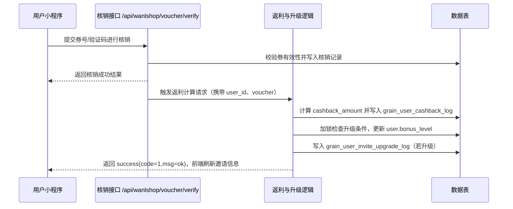

# 邀请返利 API 对接说明

> 数据结构与示例直接引用自 [invite-benefit-mock.md](invite-benefit-mock.md)，所有接口均需登录态 `token`。

## 接口清单
| 方法 | 路径 | 说明 | 是否需登录 |
| --- | --- | --- | --- |
| GET | /api/miniprogramauth/inviteInfo | 获取个人邀请概况与返利等级 | 是 |
| GET | /api/miniprogramauth/inviteeList | 查询被邀请用户列表（分页） | 是 |
| POST | /api/miniprogramauth/bindInviteCode | 绑定邀请码 | 是 |

## 通用说明
- 认证：请求头 `token: <用户登录 token>`。
- Content-Type：`application/json`（POST）。
- 统一响应壳：`code`（1 成功/0 失败）、`msg`、`time`（unix 秒）、`data`（对象或 null）。

## GET /api/miniprogramauth/inviteInfo
### 请求参数
| 字段 | 位置 | 类型 | 必填 | 说明 |
| --- | --- | --- | --- | --- |
| token | Header | string | 是 | 登录 token，未传/过期返回 0 |
| 无 | - | - | - | 其余无查询参数 |

### 响应字段（data）
| 字段 | 类型 | 说明 | 示例 |
| --- | --- | --- | --- |
| inviteCode | string | 邀请码，8 位大写字母数字 | AB12CD34 |
| level | int | 当前等级（0/1/2） | 1 |
| levelName | string | 等级名称 | Level 1 |
| rebateRate | number | 当前等级返利百分比 | 1.5 |
| rebateText | string | 返利文案 | Level 1 返利 1.5% |
| invitedTotal | int | 已绑定人数 | 12 |
| verifiedInvitees | int | 已核销人数 | 8 |
| pendingInvitees | int | 未核销人数 | 4 |
| upgradeableTimes | int | 剩余可升级次数（Mock 字段，若后端未返回可视为 0） | 2 |
| nextLevel | int/null | 下一等级，达上限则 null | 2 |
| nextRebateRate | number/null | 下一等级返利百分比 | 2.0 |
| upgradeRule | string | 升级规则描述 | 被邀请人核销触发升级，最多 2 次 |
| recentRebates[] | array | 最近返利明细 | - |
| recentRebates[].inviteeId | int | 被邀请人 ID | 10201 |
| recentRebates[].inviteeNickname | string | 被邀请人昵称 | mini-user-01 |
| recentRebates[].orderId | string | 产生返利的订单号 | WX202403010001 |
| recentRebates[].amount | number | 订单金额 | 128.5 |
| recentRebates[].rebateAmount | number | 返利金额 | 1.93 |
| recentRebates[].writeoffAt | string | 核销时间 | 2024-03-01 10:12:30 |

### 成功示例
```json
{
  "code": 1,
  "msg": "ok",
  "time": 1710000000,
  "data": {
    "inviteCode": "AB12CD34",
    "level": 1,
    "levelName": "Level 1",
    "rebateRate": 1.5,
    "rebateText": "Level 1 rebate 1.5%",
    "invitedTotal": 12,
    "verifiedInvitees": 8,
    "pendingInvitees": 4,
    "upgradeableTimes": 2,
    "nextLevel": 2,
    "nextRebateRate": 2.0,
    "upgradeRule": "Invitee write-off triggers level up, max 2 upgrades",
    "recentRebates": [
      {
        "inviteeId": 10201,
        "inviteeNickname": "mini-user-01",
        "orderId": "WX202403010001",
        "amount": 128.50,
        "rebateAmount": 1.93,
        "writeoffAt": "2024-03-01 10:12:30"
      }
    ]
  }
}
```

### 失败示例（未登录）
```json
{
  "code": 0,
  "msg": "please login first",
  "time": 1710000000,
  "data": null
}
```

## GET /api/miniprogramauth/inviteeList
### 请求参数
| 字段 | 位置 | 类型 | 必填 | 说明 |
| --- | --- | --- | --- | --- |
| page | Query | int | 否 | 页码，默认 1 |
| limit | Query | int | 否 | 每页条数，默认 10 |
| token | Header | string | 是 | 登录 token，未传/过期返回 0 |

### 响应字段（data）
| 字段 | 类型 | 说明 | 示例 |
| --- | --- | --- | --- |
| page | int | 当前页 | 1 |
| perPage | int | 每页条数 | 10 |
| total | int | 总条数 | 2 |
| list[] | array | 受邀用户列表 | - |
| list[].userId | int | 用户 ID | 20101 |
| list[].nickname | string | 昵称 | mini-user-02 |
| list[].avatar | string | 头像 URL | https://cdn.example.com/avatar/20101.png |
| list[].inviteCode | string | 绑定的邀请码 | AB12CD34 |
| list[].bindAt | string | 绑定时间 | 2024-02-28 09:15:00 |
| list[].writeoffCount | int | 贡献的核销量 | 3 |
| list[].lastWriteoffAt | string/null | 最近核销时间 | 2024-03-02 14:22:10 |
| list[].status | string | pending（已绑定未核销）/verified（已核销） | verified |
| list[].rebateRate | number | 应用的返利百分比 | 1.5 |
| list[].upgradeCount | int | 触发升级次数（每个被邀请人最多 1 次） | 1 |

### 成功示例
```json
{
  "code": 1,
  "msg": "ok",
  "time": 1710000050,
  "data": {
    "page": 1,
    "perPage": 10,
    "total": 2,
    "list": [
      {
        "userId": 20101,
        "nickname": "mini-user-02",
        "avatar": "https://cdn.example.com/avatar/20101.png",
        "inviteCode": "AB12CD34",
        "bindAt": "2024-02-28 09:15:00",
        "writeoffCount": 3,
        "lastWriteoffAt": "2024-03-02 14:22:10",
        "status": "verified",
        "rebateRate": 1.5,
        "upgradeCount": 1
      },
      {
        "userId": 20102,
        "nickname": "mini-user-03",
        "avatar": "https://cdn.example.com/avatar/20102.png",
        "inviteCode": "AB12CD34",
        "bindAt": "2024-03-02 16:45:30",
        "writeoffCount": 0,
        "lastWriteoffAt": null,
        "status": "pending",
        "rebateRate": 1.2,
        "upgradeCount": 0
      }
    ]
  }
}
```

### 失败示例（token 过期）
```json
{
  "code": 0,
  "msg": "token expired",
  "time": 1710000050,
  "data": null
}
```

## POST /api/miniprogramauth/bindInviteCode
### 请求参数
| 字段 | 位置 | 类型 | 必填 | 说明 |
| --- | --- | --- | --- | --- |
| invite_code | Body | string | 是 | 8 位大写字母数字，不能绑定自己且不可重复绑定 |
| token | Header | string | 是 | 登录 token |

### 响应字段（data）
| 字段 | 类型 | 说明 | 示例 |
| --- | --- | --- | --- |
| inviteCode | string | 成功绑定的邀请码 | CD56EF78 |
| inviterLevel | int | 绑定后邀请人的等级 | 0 |
| rebateRate | number | 当前等级返利百分比 | 1.2 |
| boundAt | string | 绑定时间 | 2024-03-03 08:00:00 |
| isFirstBind | boolean | 是否首次绑定 | true |
| upgradeHint | string | 核销后的升级提示 | Write-off will upgrade inviter level, capped at 2 upgrades |

### 成功示例
```json
{
  "code": 1,
  "msg": "bind success",
  "time": 1710000100,
  "data": {
    "inviteCode": "CD56EF78",
    "inviterLevel": 0,
    "rebateRate": 1.2,
    "boundAt": "2024-03-03 08:00:00",
    "isFirstBind": true,
    "upgradeHint": "Write-off will upgrade inviter level, capped at 2 upgrades"
  }
}
```

### 失败示例
- 邀请码格式错误
```json
{
  "code": 0,
  "msg": "invite code format invalid",
  "time": 1710000100,
  "data": null
}
```

- 已绑定其他邀请人
```json
{
  "code": 0,
  "msg": "invite code already bound",
  "time": 1710000101,
  "data": null
}
```

## 核销-返利-升级时序图

